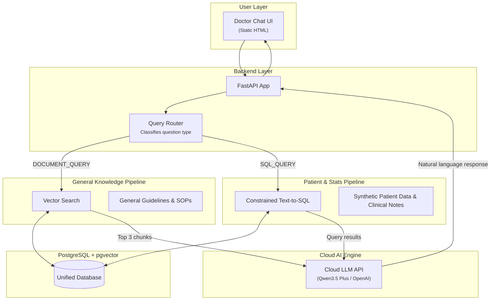

# Clinic AI Assistant Demo: Implementation Guide

This project is a **Proof of Concept (PoC) RAG chatbot for a clinic group database**.

The goal is to demonstrate the **potential of AI-powered clinical assistants** that allow doctors to ask natural language questions about clinic guidelines, clinic operational statistics, and specific patient histories. 

This is **NOT a production system**. The architecture intentionally utilizes a Cloud LLM API for rapid prototyping, reserving secure, local-LLM deployment as the primary upgrade for the production contract.

---

# Demo Objectives & Pitch Strategy

The demo must flawlessly execute two core technical capabilities while setting up the business pitch:

1. **Clinical Knowledge Q&A (Unstructured Data via RAG)**
   Doctors can ask questions about general clinic guidelines, SOPs, and drug formularies (e.g., "What is the treatment guideline for hypertension?").
   *Powered by Vector Search (RAG).*

2. **Clinic Data & Patient History (Structured Data via SQL)**
   Doctors can ask questions about clinic statistics or specific patient records (e.g., "How many diabetic patients visited last month?" or "Summarize John Doe's clinical notes from his last visit").
   *Powered by constrained Text-to-SQL against a synthetic database.*

3. **The "Privacy Upgrade" Pitch (Business Goal)**
   The demo uses a Cloud LLM (Qwen3.5 Plus) for ease of setup. When the client inevitably asks about patient data privacy, the developer will pitch the production architecture: migrating the Cloud LLM to a secure, offline Local LLM running within the clinic's VPC to ensure absolute HIPAA/PDPA compliance.

---

# High Level Architecture

The system uses a **strict branching hybrid architecture**.

# Technology Stack
- Frontend: Static HTML + Tailwind CSS (Clean, responsive chat interface)
- Backend: Python / FastAPI
- Database: PostgreSQL with pgvector extension
- LLM Engine: Cloud LLM API (Qwen3.5 Plus)
- Data: Synthetic clinic dataset (SQL)

# Data Partitioning Strategy (Crucial for Demo Stability)
To prevent the AI from hallucinating patient data into general medical answers, data is strictly partitioned.

## 1. Relational Schema (SQL Target)
Houses all structured data AND patient-specific unstructured text.
- Patient: Patient Id, Name
- Clinic: Clinic Id, Name
- Visit: Visit Id, Clinic Id (FK), Patient Id (FK), Date
- Diagnoses: Diagnosis Id, Visit Id (FK), Description
- Prescriptions: Prescription Id, Visit Id (FK), Drug Name
- Clinical Notes: Note Id, Visit Id (FK), Diagnosis, Clinical Notes text 
  (Note: Clinical Notes are stored here as standard text, NOT embedded. They are retrieved via SQL WHERE patient_name = 'X' before being summarized by the LLM).

## 2. Vector Schema (RAG Target)
Houses ONLY general, non-patient-specific medical knowledge.
- Document_Chunks: Chunk Id, Document Name, Content (Text), Embedding (Vector)
  (Contains: Standard Operating Procedures, Medical Treatment Guidelines, Drug Formularies).

---

# Core System Components

## 1. Chat Interface

A clean static HTML frontend strictly focused on the chat experience.
**Features:** Chat history (ephemeral, stored in state), streaming LLM responses, and 3 suggested starter questions to guide the client during the demo.

## 2. Query Router

A strict classifier using the Cloud LLM to prevent cross-contamination.
- If "What is the standard treatment for hypertension?" -> Route to DOCUMENT_QUERY (Searches vector guidelines).
- If "What did the doctor write in Jane Doe's clinical notes?" -> Route to SQL_QUERY (Generates SQL to pull Jane's note, then summarizes).

## 3. Document RAG

General guideline documents are chunked (~500 tokens), embedded, and stored in Document_Chunks. The router retrieves the top 3 semantic matches and passes them to the LLM.

## 4. Constrained Text-to-SQL Module

The system uses a highly constrained prompt providing the LLM with the exact relational schema. The LLM generates the SQL, FastAPI executes it against the synthetic database, and returns the raw rows (whether it's a count of patients or a paragraph of clinical notes) to the LLM for natural language generation.

---

# Docker 
- refer to **docker-compose.yml** to start the containers.
- startup command: "docker compose up -d --build".

---

# Safety & Scope Rules

## SQL Safety:
- The database user assigned to the FastAPI backend MUST have READ ONLY permissions.
- Append LIMIT 100 to all generated SQL queries automatically to prevent UI lockups during the demo.

## Out of Scope (For Production Only):
- Local LLM Deployment (The core security pitch).
- Multi-agent orchestration.
- Persistent memory (Redis).
- Complex file-ingestion pipelines (OCR/PDF parsing).
- User Authentication & RBAC.
